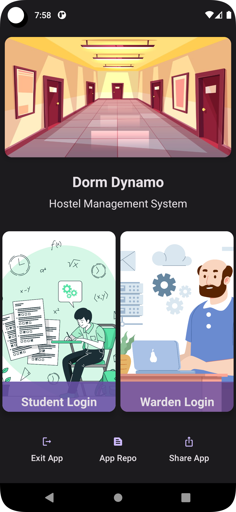
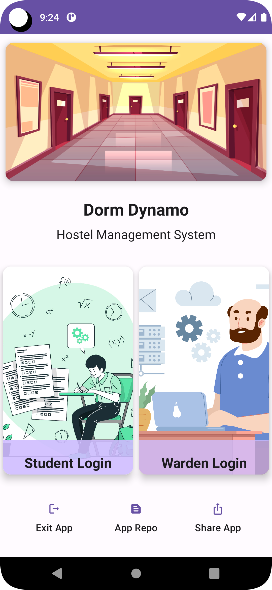
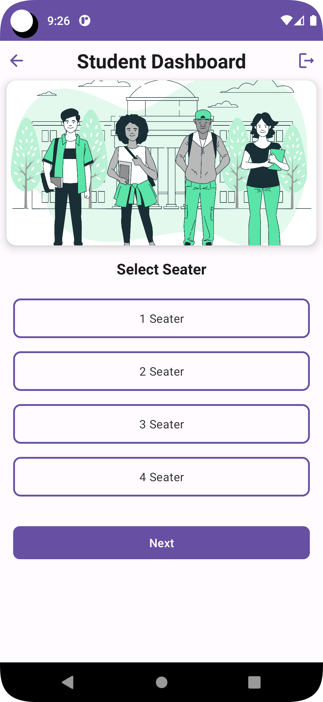
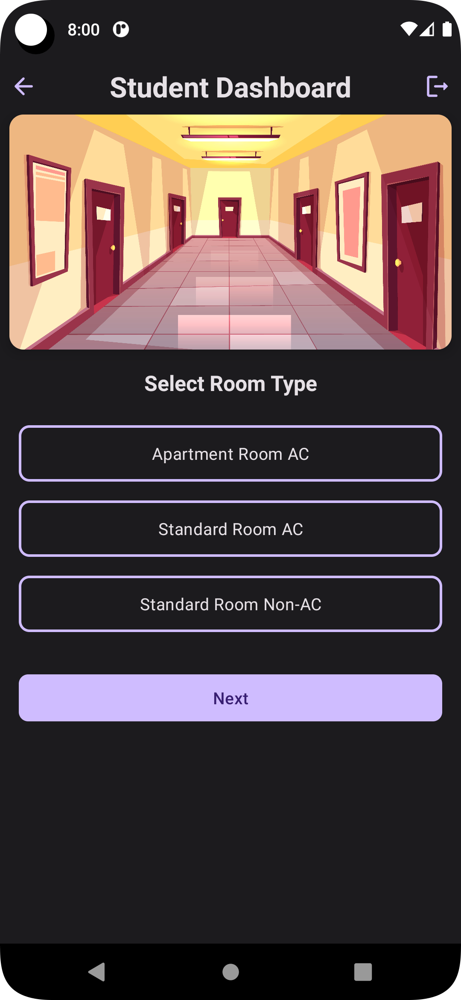
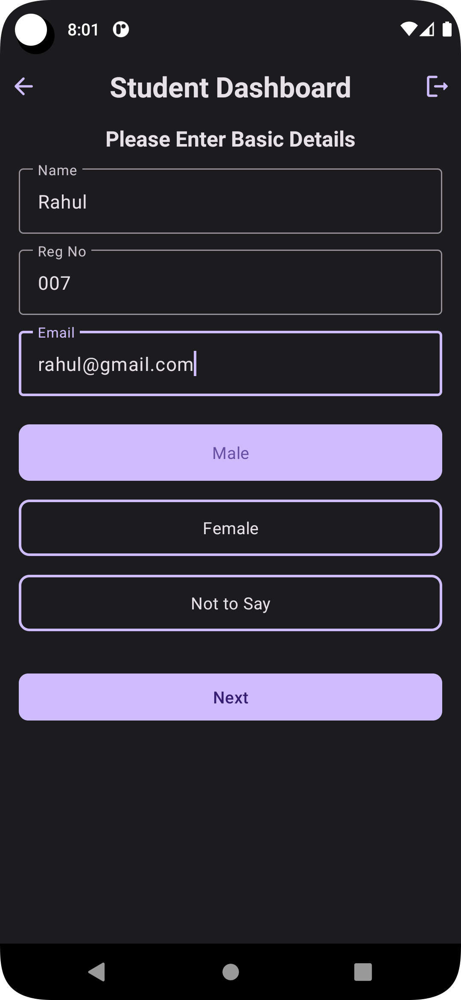
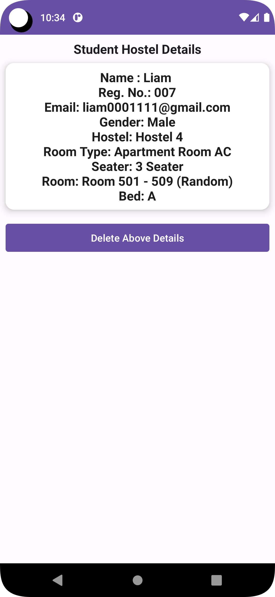

<p align="center">
  
<p>

<h1 align="center">Hostel Yangu</h1>

<p align="center">
Hostel Yangu is an android application designed to manage hostels in educational institutions. The application features two logins, one for students and another for wardens. The students can select hostels, rooms, and other amenities, whereas the wardens can access student details. 
</p>

<div align="center">
    <a href="https://github.com/godwins3/hostelyangu/releases">

  
  </a>
      <a href="https://github.com/godwins3/hostelyangu/releases/latest">
    
  </a>
  <a href="https://github.com/godwins3/hostelyangu/blob/main/LICENSE.md">
    
  </a>
  
</div>

## Tech Stacks

- <b>Firebase Authentication:</b> Used for student login and authentication.
- <b>Shared Preferences:</b> Used for warden login and to store admin credentials locally.
- <b>Room Database:</b> Used to store data related to hostels, rooms, and student details.
- <b>Splash Screen:</b> Used to show a welcome screen when the app is launched.
- <b>View Pager:</b> Used to display banners in cardView on Home page.
- <b>Material Design:</b> Used to implement a consistent and modern design language throughout the application.

## Installation

To install the application, follow these steps:

1. Clone the repository to your local machine using following Git command or download the ZIP file and extract it.
   ```bash
   git clone https://github.com/godwins3/HostelYangu.git
   ```
2. Open the project in Android Studio.
3. Create a new Firebase project and add the Android app to it. Follow the instructions in the Firebase console to generate a `google-services.json` file for your app.
4. Add the `google-services.json` file to the app folder in the project. Make sure that the file is named exactly `google-services.json` and is located in the app/ directory.
5. Build and run the app on an emulator or a physical device.

## Download

Go to the [Releases](https://github.com/godwins3/HostelYangu/releases) to download.

Or directly [Download](https://github.com/godwins3/HostelYangu/releases/download/v1.0.1/HostelYangu.apk) APK.

## Screenshots

|                   Splash Screen                   |                        Home                        |                      Home/Light                       |
|:-------------------------------------------------:|:--------------------------------------------------:|:-----------------------------------------------------:|
|                 |                        |                    |
|                   Student Login                   |                  Student Register                  |                Student Dashboard/Light                |
|           |      |  |
|              Student Dashboard Form               |                Student Basic Detail                |              Student Final Detail/Light               |
|    |    |            |

## Contributing

Contributions to the application are welcome. If you find any bugs or have any suggestions for improvement, please create an issue or a pull request on the GitHub repository.